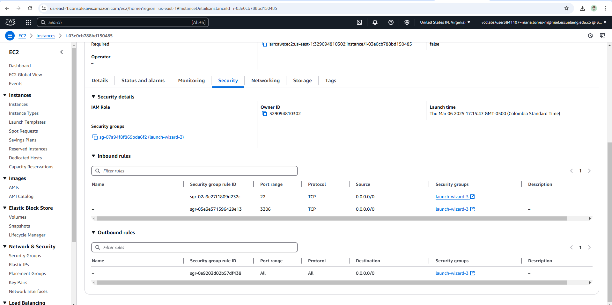
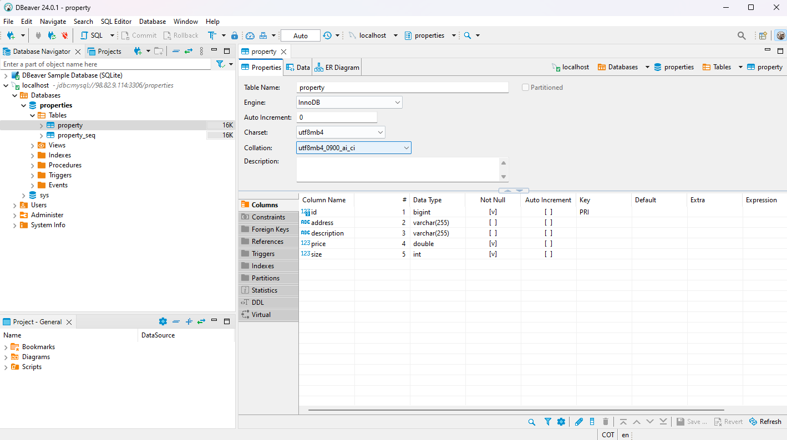
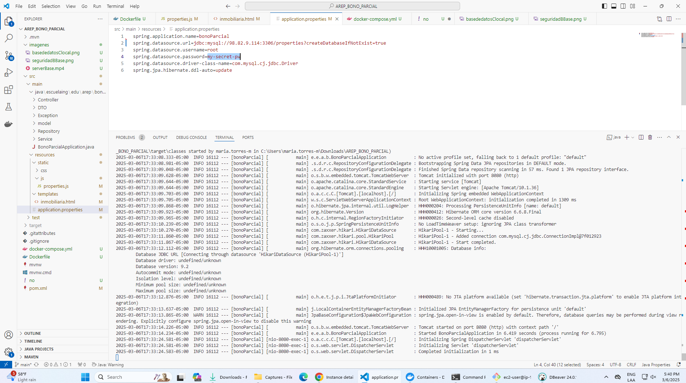
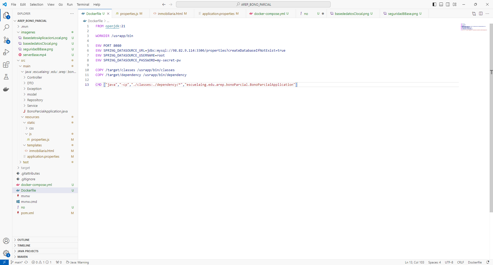
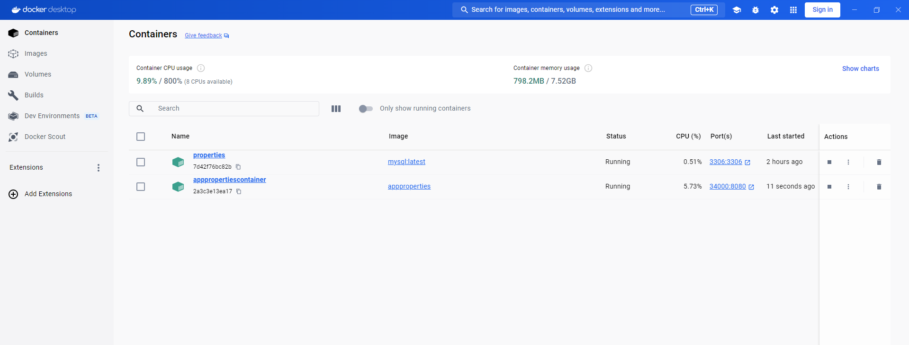
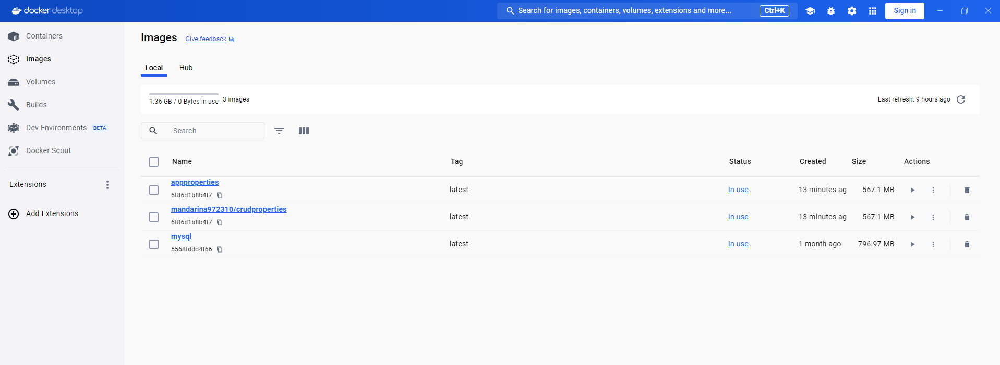
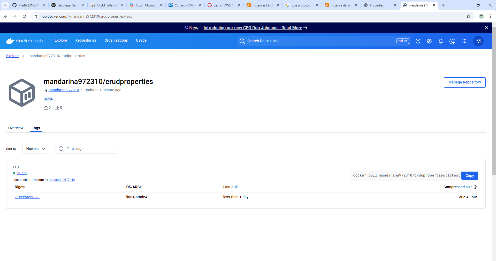
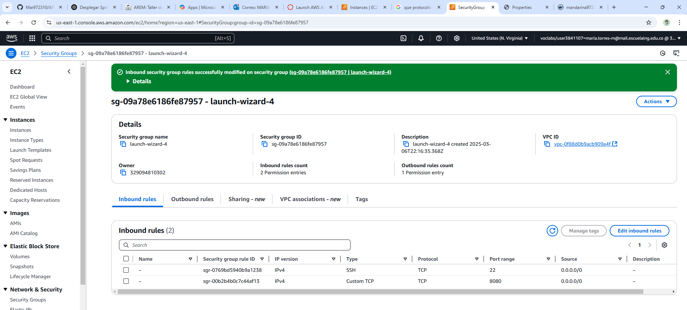

Here is the README in English:

```markdown
# Project Setup and Deployment Guide

This guide will walk you through the process of setting up the environment, configuring Docker, creating the application, and deploying it on AWS.

## 1. Create the Database on the First Server

Run the following command to start the MySQL container:

```bash
docker run -p 3306:3306 --name properties -e MYSQL_ROOT_PASSWORD=my-secret-pw -d mysql:latest
```

- If the image is not found locally, Docker will download the latest version of MySQL.
- Once the image is downloaded, it will create the container with the specified root password.

### Expected Output:
```bash
Unable to find image 'mysql:latest' locally
latest: Pulling from library/mysql
# (details of image download)
Digest: sha256:146682692a3aa409eae7b7dc6a30f637c6cb49b6ca901c2cd160becc81127d3b
Status: Downloaded newer image for mysql:latest
1aba2bdd6cfed639f931cef56936c48a49c1a1a3860ff5b979c9cf6b888060e7
```

## 2. Configure Server Ports

Ensure you enable port `3306` so that any IP can access the database. This step may require modifying security settings to open the port.



## 3. Test Database Connection

Test the connection using **DBeaver** or directly from the application running on your local machine.

### Screenshots:
- Local Database Connection: 
- Application Database Connection (Local): 

## 4. Configure the Spring Boot Application

Update your `application.properties` file with the correct database connection details:

```properties
spring.application.name=bonoParcial
spring.datasource.url=${SPRING_DATASOURCE_URL}
spring.datasource.username=${SPRING_DATASOURCE_USERNAME}
spring.datasource.password=${SPRING_DATASOURCE_PASSWORD}
spring.datasource.driver-class-name=com.mysql.cj.jdbc.Driver
spring.jpa.properties.hibernate.dialect=org.hibernate.dialect.MySQL8Dialect
spring.jpa.hibernate.ddl-auto=update
spring.jpa.show-sql=true
```

**Dockerfile Configuration**:
Update the `Dockerfile` to ensure the application is properly packaged and deployed.



## 5. Create the Docker Image

To include all dependencies, add the following Maven plugin to your `pom.xml`:

```xml
<plugin>
    <groupId>org.apache.maven.plugins</groupId>
    <artifactId>maven-dependency-plugin</artifactId>
    <version>3.0.1</version>
    <executions>
        <execution>
            <id>copy-dependencies</id>
            <phase>package</phase>
            <goals>
                <goal>copy-dependencies</goal>
            </goals>
        </execution>
    </executions>
</plugin>
```

### Build the Docker Image:

```bash
docker build --tag appproperties .
```

After the image is built, you can view it using the `docker ps` command or from Docker Desktop.

### Example Output:

```bash
CONTAINER ID   IMAGE          COMMAND                  CREATED       STATUS             PORTS                               NAMES
7d42f76bc82b   mysql:latest   "docker-entrypoint.s…"   9 hours ago   Up About an hour   0.0.0.0:3306->3306/tcp, 33060/tcp   properties
```

## 6. Create the Docker Container

To create the container, run:

```bash
docker run -d -p 34000:6000 --name apppropertiescontainer appproperties
```

### Example Output:
```bash
2a3c3e13ea1741af9793d5d3316407a8f46f8449752737df7dd33faac7a8e239
```



## 7. Tag the Image for Docker Hub

Tag your image to point to your Docker Hub repository:

```bash
docker tag appproperties mandarina972310/crudproperties
```



## 8. Push the Image to Docker Hub

Log in to Docker Hub and push the image using the following commands:

```bash
docker login
docker push mandarina972310/crudproperties:latest
```



## 9. Install Docker on AWS

Follow the previous instructions to install Docker on your AWS instance.

## 10. Pull the Image from Docker Hub

Download the image from Docker Hub on your AWS instance:

```bash
docker pull mandarina972310/crudproperties:latest
```

Then, run the application container on AWS:

```bash
docker run -d -p 8080:8080 --name appproperties mandarina972310/crudproperties:latest
```

### Example Output:

```bash
1977c28fee77576247c902bcf8639eaa0649f40d6ae4e9e7717cebb091f49857
```

## 11. Enable the Port on AWS

You need to allow the port used in the Docker container (8080) in the AWS security settings. Add a new inbound rule to the security group.



Once completed, you can access the application at:

```
http://ec2-44-210-144-162.compute-1.amazonaws.com:8080/home
```

## 12. Deployment Video

A video of the complete deployment process is available here:

[Deployment Video](#)
```
